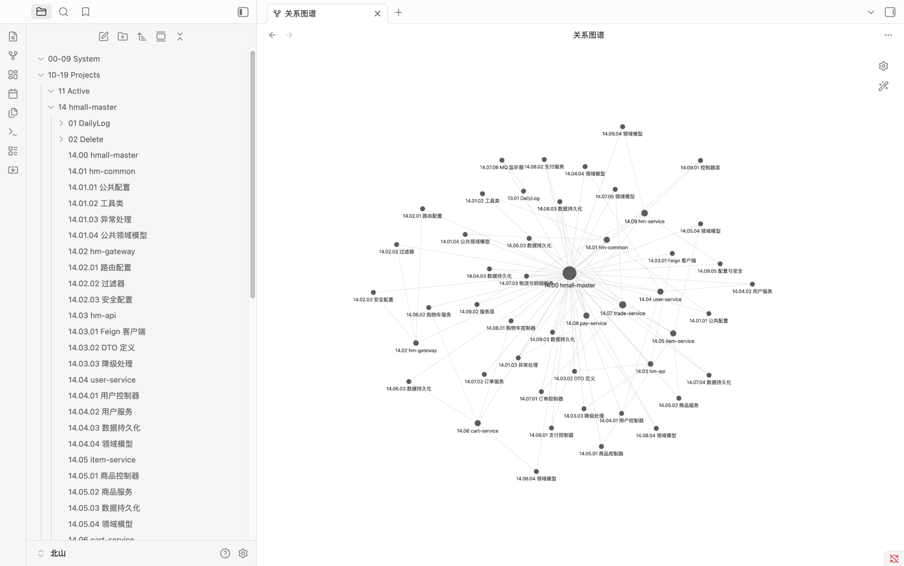

[中文](README.zh.md) | **English**

---

# Obsidian Sync for Claude Code

A cross-agent skill that automatically transforms your codebase into an Obsidian knowledge graph.

> This skill follows the [Agent Skills specification](https://github.com/anthropics/skills) and works with any skills-compatible agent, including **Claude Code**, **Codex CLI**, and **OpenCode**.

---

## What It Does

This skill bridges your agent and Obsidian. It analyzes your project and generates a layered architecture graph:

```
project → module → service → external API → class/interface → method → database table
```

Each layer becomes a standalone Markdown file with Obsidian wikiLinks, forming a browsable, locally-stored architecture graph in your Vault.



### Why This Saves Tokens & Context

- **Precision retrieval** — The model navigates the graph hierarchy instead of scanning the entire codebase, locating target files in seconds.
- **On-demand loading** — Reduces exploratory reads without replacing source code. It acts as an index/table of contents, allowing the model to pinpoint exactly what it needs.
- **Focused context** — Only the relevant node summaries are loaded into the conversation, cutting token usage dramatically.
- **Persistent memory** — Architecture, design decisions, and dev logs are stored structurally and reused across sessions without repetition.
- **Fully local & private** — All graph data stays in your local Obsidian Vault. Zero cloud upload. Zero leakage risk.

---

## Installation

```bash
Obsidian client must be installed before using this skill.
```

### Claude Code — Plugin Marketplace

```bash
# If this skill is published to a marketplace
claude plugin marketplace add CzhJing/obsidian-sync-skill
claude plugin install obsidian-sync@obsidian-sync-skill
```

### Claude Code — Local Plugin Install

```bash
git clone https://github.com/CzhJing/obsidian-sync-skill.git
cd obsidian-sync-skill
claude plugin install .
```

### Claude Code — Manual (skills folder)

Copy the skill into your Claude Code skills directory:

```bash
# Repo-level: inside your project
mkdir -p .claude/skills
cp -r skills/obsidian-sync .claude/skills/

# Or user-level: ~/.claude/skills/
ln -s $(pwd)/skills/obsidian-sync ~/.claude/skills/obsidian-sync
```

### Codex CLI

Copy the `skills/` directory into your Codex skills path:

```bash
mkdir -p ~/.codex/skills
cp -r skills/obsidian-sync ~/.codex/skills/
```

### OpenCode

Clone the full repo into the OpenCode skills directory (do **not** copy only the inner `skills/` folder):

```bash
git clone https://github.com/CzhJing/obsidian-sync-skill.git ~/.opencode/skills/obsidian-sync-skill
```

OpenCode auto-discovers all `SKILL.md` files under `~/.opencode/skills/`. Restart OpenCode to use the skill.

### npx skills

```bash
npx skills add git@github.com:CzhJing/obsidian-sync-skill.git
```

---
### First Run

1. You will be prompted for your Obsidian Vault absolute path (e.g. `/Users/yourname/Documents/obsidian`).
2. After entering the path, the skill will:
   - Create standard Vault directories (`10-19 Projects`, etc.)
   - Identify the current project and assign a JD number
   - Generate the architecture graph at your chosen detail level

### Menu Options

After the first sync, running `/obsidian-sync` presents:

| Option | Description |
|--------|-------------|
| 1 | Update description & tech stack |
| 2 | Add dev log |
| 3 | Update repository (sync code changes) |
| 4 | Full sync (run all of the above) |
---
## Usage

You can use this skill in **two ways**. Choose the one that fits your workflow:

### Option A: Trigger on demand (manual)

Include `/obsidian-sync` at the beginning of your message whenever you want the agent to read the Obsidian architecture graph before handling a task. For example:

```
/obsidian-sync implement batch delete for shopping cart
/obsidian-sync fix the user login bug
/obsidian-sync write unit tests for OrderService
```

This is the simplest way — no extra setup required.

### Option B: Auto-load for every session (project-level)

If you want the "graph first, source code second" rule to apply **automatically** without typing `/obsidian-sync` each time, create a file named `.claude/CLAUDE.md` in your project root and paste the following content into it:

````markdown
## Obsidian Architecture Graph — Priority Strategy

VAULT_PATH = "{Your Vault absolute path}"

When the user makes any of the following requests, always read from the Obsidian architecture documents first to establish context, before deciding whether to read specific source files:
- Implementing new features / adding interfaces / developing modules
- Fixing bugs / troubleshooting issues
- Refactoring / optimizing performance
- Explaining how a module, class, or method works
- Writing test cases

### Reading Order (Strict)

1. Match the last segment of `cwd` against `NN {project-name}` folders under `VAULT_PATH/10-19 Projects/`
2. Verify that the `Location` field in `NN.00 {project-name}.md` matches `cwd`
3. Read the top-level file to get tech stack, module list, and core file mapping
4. Use keywords from the user's request to locate the relevant module, then read the corresponding MD file
5. When `type` is `B-File-Level Detail`, drill down to class/method level as needed
6. Only then use `Grep` / `Glob` / `Read` to read source code

### Fallback Strategy

- No matching project found → prompt the user to run `/obsidian-sync` first
- Project found but module MD missing → inform the user and read source code directly

### Key Principles

- Only read files with `status: active`; skip files with `deleted` status
- A wikiLink `[[NN.MM.SS name]]` is the filename of the next layer to read — parse and follow it directly
- Build global awareness from the graph first to avoid blind searching through the codebase
````

> **Remember:** Replace `VAULT_PATH` with your actual Obsidian Vault absolute path (e.g. `/Users/yourname/Documents/obsidian`).
>
> Once this file is in place, Claude Code will load it into **every session** in this project.

---

## License

MIT
